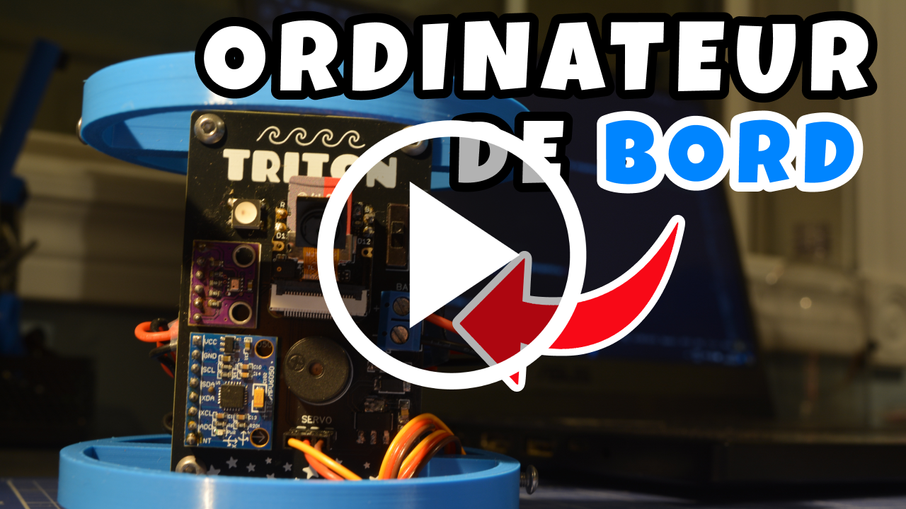
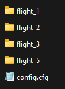
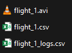
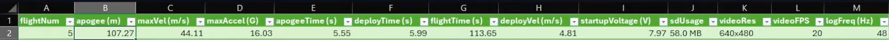
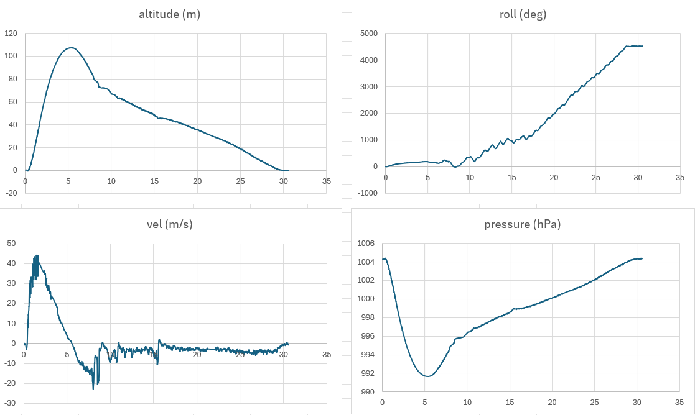
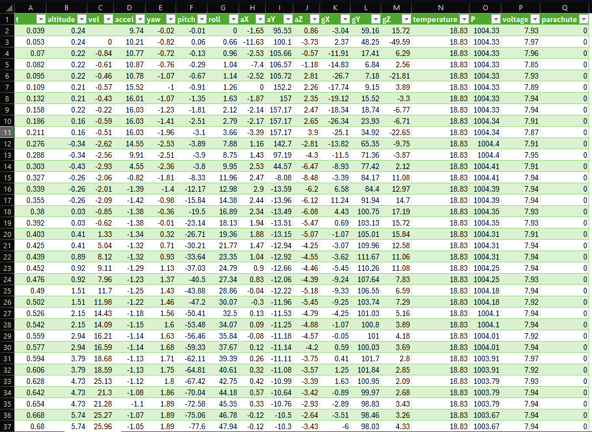
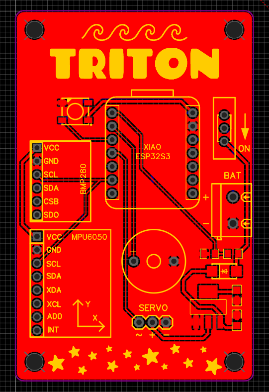
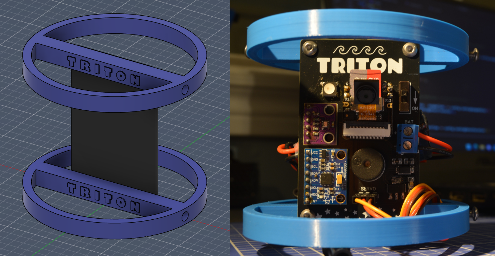

# Triton

I've always enjoyed launching water rockets, but I wanted to learn more about what happens during flight. That's why I built Triton, a simple flight computer based on the Xiao ESP32-S3. Featuring a BMP280 barometer and a MPU6050 IMU, Triton combines data logging to an SD card at 50 Hz, onboard video recording and even automatic parachute deployment, all in one package! This was also my first time designing a PCB so it was definitely a fun project!

## Components List

- Seeed Studio Xiao ESP32-S3 Sense
- BMP280 Barometer
- MPU6050 IMU (I know, not a great pick for a rocket but at least it's dirt cheap)
- OV2640 Camera
- Passive Buzzer
- WS2812B RGB LED
- Servo Motor
- 7.4V 450 mAh Lipo Battery

## SD Card

Triton produces a flight directory on the SD card for each new flight.
Inside each flight directory, it saves:
- `flight_1.csv`: a CSV file containing flight stats
- `flight_1_lgs.csv`: a CSV file containing flight data logged at ~50 Hz
- `flight_1.avi`: an AVI video file of the onboard camera footage

## Configuration file
To add more flexibility, Triton has a configuration system with different parameters that can be adjusted to achieve the desired behaviour. Triton will load the configuration from a `config.cfg` file at startup. If the file is not present, it will be created with a default configuration.
Each line of the config file must follow the following format: `parameter=value`. Comments can be added by starting a line with `#`

Here is a list of every parameter:

| Parameter               | Default       | Type   | Description                                                                                                      |
|-------------------------|---------------|--------|------------------------------------------------------------------------------------------------------------------|
| `buzzer`                | true          | bool   | Toggle buzzer                                                                                                    |
| `ledBrightness`         | 255           | int    | LED brightness (0-255)                                                                                                  |
| `servoHome`             | 180           | int    | Servo home position in degrees (0-180)                                                                                  |
| `servoDeploy`           | 80            | int    | Servo position to deploy the parachute in degrees (0-180)                                                               |
| `vidRes`                | VGA           | res | Video resolution, see "Onboard video" section below for resolution options                                      |
| `vidFPS`                | 20            | int    | Target video fps (actual fps may vary due to ESP32S3 memory limitations)                                        |
| `lowVoltageAlarm`       | 7.40          | float  | Battery voltage threshold for alarm at startup                                                                  |
| `voltageOffset`         | 0.00          | float  | Offset for voltage readout                                                                                      |
| `launchDetectThreshold` | 1.50          | float  | Vertical acceleration (in G's) required to trigger launch detection                                             |
| `apogeeDetectThreshold` | 1.00          | float  | Altitude difference (in meters) required to trigger apogee detection                                            |
| `landingDetectThreshold`| 1.00          | float  | Maximum stable velocity (in m/s) allowed to consider the rocket as landed                                       |
| `landingDetectDuration` | 3.00          | float  | Duration (in seconds) for velocity to stay below `landingDetectThreshold` to trigger landing detection          |
| `landingApogeeDelay`    | 5.00          | float  | Minimum delay (in seconds) between apogee detection and landing detection                                       |
| `minDeployTime`         | 2.00          | float  | Minimum parachute deployment time (in seconds) to avoid premature deployment|
| `logTemp`               | /current.csv  | path | Path to the current flight log temporary file                                                                    |
| `aviTemp`               | /current.avi  | path | Path to the current video temporary file                                                                         |
| `logDir`                | /flight_%i    | path | Flight directory name                                                                                |
| `statsFile`             | /flight_%i.csv| path | Flight statistics file name                                                                               |
| `logFile`               | /flight_%i_logs.csv | path | Flight logs file name                                                                                     |
| `aviFile`               | /flight_%i.avi| path | Flight video file name                                                                                   |

Each file name must start with `/` and `%i` is be replaced by the flight number.

## Onboard video

By default the video has a VGA resolution (640x480) at 20 fps. (This GIF is compressed and is only 10 fps to reduce the file size).
The code for the video comes from the [ESP32-CAM_MJPEG2SD](https://github.com/s60sc/ESP32-CAM_MJPEG2SD) project. I only keep the necessary functions.

The resolution and fps can be modified in the configuration file. These are the options:

Frame Size | Max fps
------------ | -------------
96X96 | 45
QQVGA | 45
QCIF | 45
HQVGA | 45
240X240 | 45
QVGA | 40
CIF | 40
HVGA | 40
VGA | 20
SVGA | 20
XGA | 5
HD | 5
SXGA | 5
UXGA | 5

## Flight Data

## Schematic

The flight computer is powered by a 2S Lipo battery (7.4V) with a capacity of 450 mAh, which is enough to keep the system running for about 2 hours. I used a linear voltage regulator to bring the battery voltage down to a stable 5V which is fed to the Xiao ESP32-S3 and the servo motor. The Xiao board integrates a 3.3V regulator.

Two resistors are wired in series to serve as a voltage divider. The values of 100k and 64.9k Ohms have been calculated so that when the battery is fully charged at 8.4V, a 3.3V signal goes to one of the ESP32's analog inputs.

I added a status LED (WS2812B), which only takes 1 digital pin, as well as a passive buzzer for additional feedback.

## PCB Design

## 3D Printed Brackets

